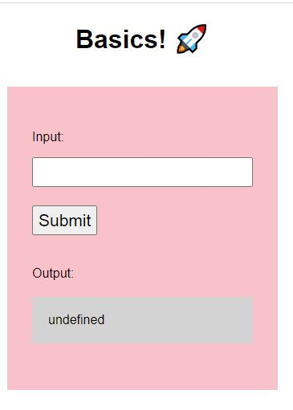

Q3: removing returns will result in "undefined" because what to display is not defined. Returns tell what to display after clicking submit 
Q4: Remove the `distanceInKm `parameter from the function definition results in "uncaught referenceError in console  because the function `convertKmToMiles` doesnt not know what input it is working with  
Q5: Changing the name distanceInKm to something consistently everywhere still works. Bcos it is consistently recognised as the new input.